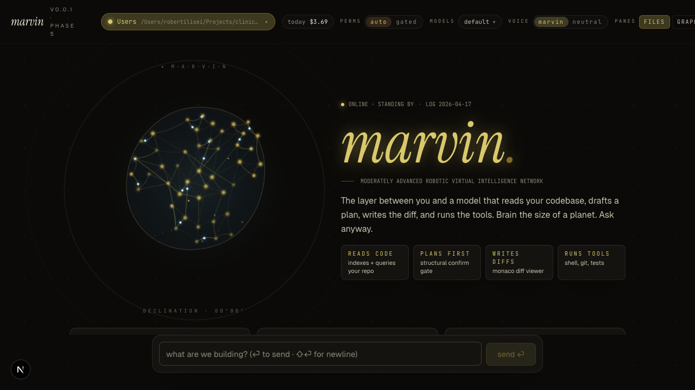

# MARVIN



**M**oderately **A**dvanced **R**obotic **V**irtual **I**ntelligence **N**etwork.

A pair-programming AI assistant. You drive vision and business decisions. MARVIN
drives architecture, infrastructure, code, tests, docs, and security.

You say *"let's build the login page"* — MARVIN dives in: reads the codebase,
proposes the schema + wiring + tests, executes with explicit confirms, commits.

> "Here I am, brain the size of a planet, and they ask me to build a login page."
> — MARVIN, probably

## What makes MARVIN different

- **Single assistant, not an agent team.** Published research on sequential
  coding tasks shows multi-agent autonomy degrades quality up to ~70 % and
  amplifies error rates 17× in flat-topology setups. MARVIN is one assistant
  moving through an 8-phase workflow in one conversation, with the user as
  continuous overwatch.
- **Plan-first, execute-second, verify-third.** Every feature lives in
  [PLAN.md](./PLAN.md) before code lands.
- **Per-project isolation.** MARVIN holds zero cross-session knowledge about
  other projects. Memory, ADRs, and knowledge graph live inside each user
  project, not in MARVIN's own data dir.
- **Built on a knowledge graph.** Queries [graphify](https://github.com/safishamsi/graphify)
  first on architecture/impact questions — ~36× cheaper than reading raw
  files.

## Features

- 🧠 **MARVIN brain** — live animated state indicator (idle / thinking / tool /
  writing / error)
- 📁 **3-pane shell** — file tree · chat · brain/graph, with collapsible
  embedded terminal, file viewer, and browser preview
- 🔀 **Monaco diff viewer** — see exactly what MARVIN is about to do before
  allowing it; structural confirm-before-act gate on Edit/Write/Bash
- 🧰 **Model picker** — executor + advisor slots, live Anthropic model list
  when credentials are readable, fallback when not
- 💸 **Cost tracker** — daily/weekly/lifetime spend per project
- 🔍 **Graph-aware chat** — in-process MCP server exposes the graphify graph
  (`graph_summary`, `graph_search`, `graph_neighbors`, `graph_path`) so MARVIN
  orients before the first tool call
- ⌨️  **Keyboard shortcuts** — `⌘K` picker · `⌘B/G/J/P` pane toggles · `⌘.`
  cancel · `?` help · `Esc` close
- 🌐 **Own Playwright MCP** — MARVIN drives real browsers against
  `localhost` / LAN URLs (host Playwright MCP often sandboxes loopback)
- 🔄 **Refresh-safe turns** — closing the tab no longer kills a running turn;
  reopen and resume

## Prerequisites

- Node.js **>= 22**
- pnpm **10.33** (declared in `packageManager`)
- Claude credentials — one of:
  - `ANTHROPIC_API_KEY` in env
  - Host credentials from a `claude auth login` (auto-detected)
- For browser automation: `npx playwright install chromium`

## Quickstart

```bash
pnpm install                   # one-time — pulls deps across 7 packages
bash scripts/install-skills.sh # one-time — mirror skills bundle to ~/.claude/skills/
bin/marvin                     # start MARVIN on http://localhost:3030
```

`bin/marvin` runs every preflight check (Node ≥22, pnpm, skills, port
availability, credentials), backgrounds the dev server, polls
`/api/health`, and prints the URL + auth mode + model once it's up.

### Lifecycle

```
bin/marvin              # alias for start
bin/marvin status       # is it up? auth + model + data dir
bin/marvin logs         # tail .marvin/dev.log
bin/marvin stop         # kill the process group cleanly
bin/marvin restart
bin/marvin doctor       # preflight only — no start
bin/marvin help
```

### Raw fallback

If you want to drive `pnpm dev` directly (skipping `bin/marvin`'s
preflight + pid tracking):

```bash
pnpm dev          # foreground, Ctrl-C to stop
```

### Skills bundle

The `install-skills.sh` step mirrors the pinned Anthropic skills
(`frontend-design`, `canvas-design`, `claude-api`, `mcp-builder`,
`webapp-testing`, `skill-creator`, etc.) plus MARVIN's own adopted skills
(`test-driven-development`, `systematic-debugging`, `pr-review`,
`security-audit`) into `~/.claude/skills/` so MARVIN's SDK sessions can
invoke them. Idempotent — re-running is safe.

### Credentials

MARVIN uses the Agent SDK's auth detection in priority order: direct
`ANTHROPIC_API_KEY` env var → `~/.claude/.credentials.json` /
`~/.claude/auth.json` (Linux / Windows) → macOS Keychain (state dir
activity). See [docs/security/credentials.md](./docs/security/credentials.md)
for the full detection rules and how to pick between API-key and
host-credentials modes.

## Stack

- Next.js 16 · TypeScript · Tailwind 4 · shadcn/ui
- pnpm workspaces · Turbo
- `@anthropic-ai/claude-agent-sdk` runtime with a `canUseTool` pre-flight gate
- xterm.js terminal · monaco-editor diff viewer · react-resizable-panels
- In-process MCP servers: `marvin-graph` (graphify) + `marvin-playwright`
  (`@playwright/mcp`)

## Repo layout

```
apps/
  web/                       # Next.js 16 app, port 3030
  desktop/                   # Tauri 2 macOS wrapper (ADR-0010)
packages/
  runtime/                   # Agent SDK runner, auth, session, cost, models, turn registry
  tools/                     # tool policy (auto / confirm / deny)
  project-context/           # spec + ADR + memory + graph-header injection
  graphify-bridge/           # knowledge-graph read + MCP server
  git-watch/                 # per-workDir commit stream
  ui/                        # shadcn primitives + MARVIN brain
data/.marvin/                # session transcripts, cost tracker, graph cache (gitignored)
```

### Running as a native macOS app

`apps/desktop/` ships a Tauri wrapper — MARVIN as a dock-icon `.app`
rather than a browser tab. Needs Rust (once):

```bash
curl --proto '=https' --tlsv1.2 -sSf https://sh.rustup.rs | sh -s -- -y --default-toolchain stable --profile minimal
. "$HOME/.cargo/env"

bin/marvin                # start the web server (as usual)
pnpm desktop:dev          # in a second terminal — opens the Tauri window
```

See [`apps/desktop/README.md`](./apps/desktop/README.md) + [ADR-0010](./docs/decisions/0010-desktop-wrapper-tauri.md) for the details and what v1 deliberately leaves out.

## Status

**v1 shipped.** Phases 1–5 complete. Phase 5's Honeycomb MCP integration
is explicitly deferred (needs Honeycomb account + team setup). Everything
else — advisor mode, preview pane, graph-aware chat, keyboard shortcuts,
session search, dual-theme support, BrainLiquid canvas particle brain,
full `docs/` tree, graphify-first hard rule, REVIEW.md + adopted skills,
`bin/marvin` lifecycle script — shipped 2026-04-17 through 2026-04-19.

See [PLAN.md](./PLAN.md) for the phase-by-phase changelog and
[docs/roadmap.md](./docs/roadmap.md) for the narrative view.

## Documentation

Full documentation at [docs/](./docs/). Modeled on Claude Code's docs site.

**Entry points:**
- [Overview](./docs/getting-started/overview.md) — what MARVIN is, who it's for
- [Quickstart](./docs/getting-started/quickstart.md) — install → first session
- [Architecture at a glance](./docs/getting-started/architecture.md)
- [Core concepts](./docs/README.md#core-concepts) — single-assistant, 8-phase workflow, isolation, confirm gate, advisor, graphify, ADRs
- [HTTP API reference](./docs/reference/api.md) — all 17 endpoints
- [Architecture decisions](./docs/decisions/) — ten ADRs covering the design choices

## License

[MIT](./LICENSE) · © 2026 Robert Ilisei · See [docs/business/licensing.md](./docs/business/licensing.md) for the rationale vs Apache 2.0 / MPL / GPL.
