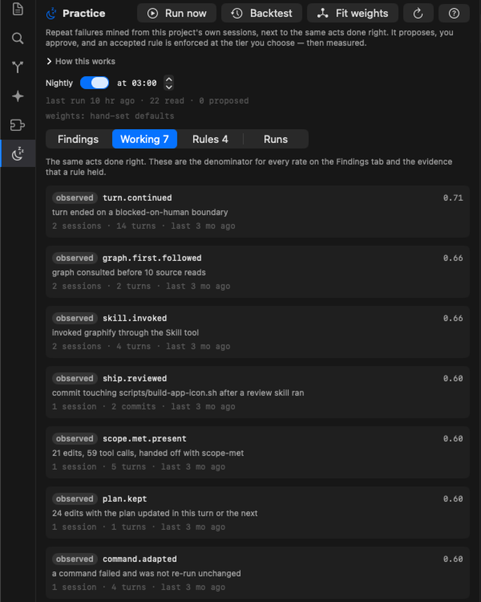
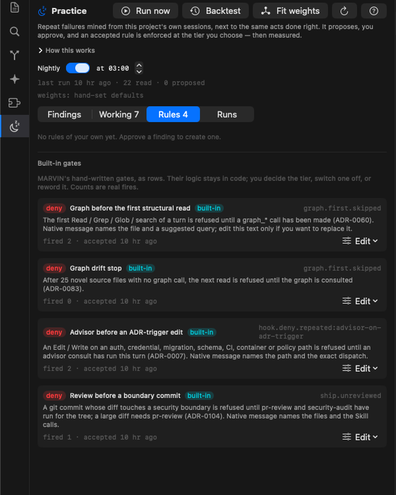

# Practice — how MARVIN learns from its own sessions

Practice is the tab in the left pane with the moon icon. It is MARVIN's
answer to a problem every AI assistant has: each session thinks it is the
first time. A mistake made on Monday is made again on Tuesday, because nothing
between the two sessions is looking.

Practice looks. Once a night it reads every session transcript of a project,
counts the same failure recurring across sessions (and the same act done
right), scores what it found, and proposes a rule when a pattern has earned
one. You approve, dismiss, or mark it fixed. An accepted rule is then
**enforced** — not as a line in a prompt, but at the moment the behaviour
happens — and **measured**: the next sessions either confirm the rule held or
show it did not.

Nothing changes MARVIN's behaviour without a click from you. No model reads a
transcript. The nightly pass is plain code.

> Design and evidence: [ADR-0105](../decisions/0105-practice-loop.md). The
> gate it generalises: [ADR-0104](../decisions/0104-ship-review-gate.md).

---

## The idea in one loop

```
sessions on disk ─▶ extractors ─▶ findings (per project) ─▶ score ─▶ proposed
                                        ▲                                 │
                                        │                            you approve
                                   verification ◀── rule enforced ◀───────┘
                                   (confirmed / regressed)
```

1. **Extractors** are deterministic functions over a transcript. Each one
   recognises one shape of failure — or its opposite, the same act done
   right — and emits an *occurrence* with a cost.
2. **Findings** collect occurrences per project, counted by **distinct
   session**. Thirty hits of the same wall in one session is one lesson.
3. **Score** is a small linear model over recurrence, cost, rate, reliability
   and actionability, minus decay. Three sessions and a score of 0.6 make a
   finding **proposed**.
4. **You decide.** Approve creates a rule. Dismiss silences it until it
   recurs at double the count. Fixed in MARVIN says you changed MARVIN's code
   instead.
5. **Enforcement** happens at one of three tiers (below).
6. **Verification** runs on the next sessions. A recurrence after acceptance
   is `regressed`; five quiet sessions are `confirmed`.

---

## What it looks for

Every failure kind has a paired success, so a finding carries a **rate**: how
often the act went wrong out of all the times it was attempted. Five skipped
turns out of two hundred is not five out of six.

| finding | what happened | paired success |
|---|---|---|
| `ship.unreviewed` | a commit touching CI, credentials, sudo, shell scripts or migrations, with no review skill run this session | `ship.reviewed` |
| `graph.first.skipped` | five or more source files read before the first graph query | `graph.first.followed` |
| `turn.stalled` | a turn ended with no question and no handoff, and you typed a bare "continue" | `turn.continued` |
| `scope.met.missing` | a turn that edited files ended without the scope-met handoff | `scope.met.present` |
| `skill.bypassed:<name>` | a skill's folder was read by hand instead of invoking the skill | `skill.invoked` |
| `review.ignored` | a review skill reported findings and nothing was edited afterwards | `review.acted` |
| `plan.stale` | three or more edits under a plan whose checklist was never updated | `plan.kept` |
| `command.retried` | the same failing command re-run unchanged | `command.adapted` |
| `hook.deny.repeated:<gate>` | one of MARVIN's gates refused the same thing again in the same turn | — |
| `cache.recreated` | a turn re-created a very large prompt cache (report only) | — |
| `error.repeated` | the same error ended two or more turns (report only) | — |
| `turn.overbudget` | a single turn cost more than the threshold (report only) | — |

**Report-only** kinds are about MARVIN's implementation or its environment,
not a behaviour a rule can change. They surface so you can see them; they
cannot be approved.

Subagent calls are never counted. A scout that opens twenty files is doing
its job.

---

## The Practice tab

<p align="center">
  
  
</p>


**Header.** *Run now* reads every session that changed since the last run.
*Backtest* re-reads everything from scratch. *Fit weights* proposes new score
weights from outcomes (see below). The **Nightly** switch and hour control the
schedule; the last run's summary sits underneath.

**Findings.** Failures, most valuable first. Each row shows the state chip,
the fingerprint, the latest detail line, and a metrics line: sessions, rate,
total cost, when last seen. Findings below the proposal threshold and the
confirmed or dismissed ones fold away.

| chip | meaning |
|---|---|
| `observed` | seen, under the threshold |
| `proposed` | earned a rule; waiting on you |
| `active` | rule accepted, verification running |
| `fixed` | you changed MARVIN's code for it; verification running |
| `regressed` | it happened again after the rule or fix |
| `confirmed` | five quiet sessions since |
| `dismissed` | silenced, with your reason |
| `report` | report-only kind past the threshold |

Actions on a finding:

- **Approve** — creates a rule from the kind's template, at the template's
  tier or one you pick, for this project or for every project.
- **Draft message** — asks a read-only model to write the rule's wording from
  the finding's aggregates and the head of your CLAUDE.md. One small call. You
  edit, then approve with it or discard it. Never sees a transcript.
- **Fixed in MARVIN** — records that you changed MARVIN's own code for this,
  with a note. Verified exactly like a rule.
- **Dismiss** — with a reason. Comes back if the count doubles.
- **Escalate** — on a regressed rule, moves it one tier up and restarts the
  clock.

**Working.** The paired successes: what MARVIN keeps doing right in this
project. They are the denominators for every rate, and the evidence a rule
held.

**Rules.** Your rules and, below them, **Built-in gates**. Each row shows the
tier, the message, and how many times it fired. *Edit* changes the tier,
rewords the message, promotes to every project, or retires the rule. When the
same rule is confirmed in two or more projects, a banner offers promotion.

**Runs.** The log: when, how many sessions read, what changed.

---

## Tiers — how a rule is enforced

| tier | mechanism | when to use it |
|---|---|---|
| **prompt** | a "Practice rules" block in every turn's system prompt | for behaviours that have no single moment to catch, like how a turn ends |
| **nudge** | when the trigger matches a tool call, the call still runs but MARVIN sees the message before its next step | the default for most rules |
| **deny** | the tool call is refused with the message, twice per turn, then allowed and logged | for acts that must not happen without a remedy |

Two brakes protect you from a bad deny. A deny only denies when its trigger
has a machine-checkable way to be satisfied, such as "a review skill ran this
session"; otherwise it is enforced as a nudge. And after two refusals in one
turn the call goes through and the bypass is counted on the rule.

Measured on this repo's own history: prompt-tier rules fire close to never on
their own, nudges help, denies hold. That ordering is why templates default to
nudge or deny where they can.

---

## Built-in gates

MARVIN ships four hand-written gates: graph before the first structural
read, the graph-drift stop, advisor before an edit on a security or schema
path, and review before a boundary commit. Since v0.1.103 each is also a row
in the Rules tab. Their logic stays in code; the row lets you set the tier,
switch one off, or replace its message, and shows how often it fired. Delete
the rows file and they return to native behaviour.

---

## Fit weights

The score's five weights start as hand-set defaults. *Fit weights* searches
for the weights that best rank findings by what later happened to them:
confirmed or fixed counts as right, regressed as half right, dismissed as
wrong. With fewer than eight findings that have an outcome, it ranks by
measured cost share instead and says so. The sheet shows current and proposed
side by side; nothing changes until you click Apply, and the provenance sits
in the header afterwards.

---

## Where the data lives

Practice is about MARVIN, not your project, so nothing is written into the
project directory.

```
~/.marvin/practice/config.json            schedule, weights, thresholds
~/.marvin/practice/rules.json             every rule, yours and built-in
~/.marvin/practice/<project>/ledger.json  findings, run log, watermarks
```

The API behind the pane is under `/api/practice` (see the
[HTTP API reference](../reference/api.md)).

---

## Starting on a project MARVIN has never seen

Nothing about the project needs calibrating: the extractors measure MARVIN's
behaviour, not your code, and the same shapes count in every project. What is
different is how much evidence exists.

- **From the first turn:** the four built-in gates, any rule you promoted to
  global, and the score weights (shared across your projects).
- **Until three sessions exist:** no finding can propose. The Findings tab
  shows a calibration card with a sessions counter so you can see how far off
  the first proposal is.
- **Proven elsewhere:** rules confirmed in your other projects that this one
  has no rule for are listed as starters. *Adopt* copies one here, scoped to
  this project, with its own verification clock — proven there, verified
  here. Adoption is your click, never automatic.

So a new project inherits what held, waits for its own evidence before
proposing anything new, and never inherits a rule that was only ever a
proposal.

---

## A first session with it

1. Open a project you have used for a while and click **Backtest**. A few
   hundred sessions read in seconds.
2. Read the proposals. For each, ask: is this MARVIN's behaviour, MARVIN's
   code, or my project? Approve the first, mark the second fixed once you have
   fixed it, dismiss the third with a reason.
3. Leave **Nightly** on. Come back in a week. Rules that held say
   `confirmed`; anything that did not says `regressed`, with an escalate
   button next to it.
4. Once a few outcomes exist, try **Fit weights**.

---

## What Practice will not do

- It will not change a rule, a tier, or MARVIN's behaviour on its own.
- It will not read a transcript with a model. The nightly pass is code; the
  only model call is *Draft message*, which you trigger and which sees
  aggregates.
- It will not run one model to supervise another. Rules come from counted
  evidence and your approval.
