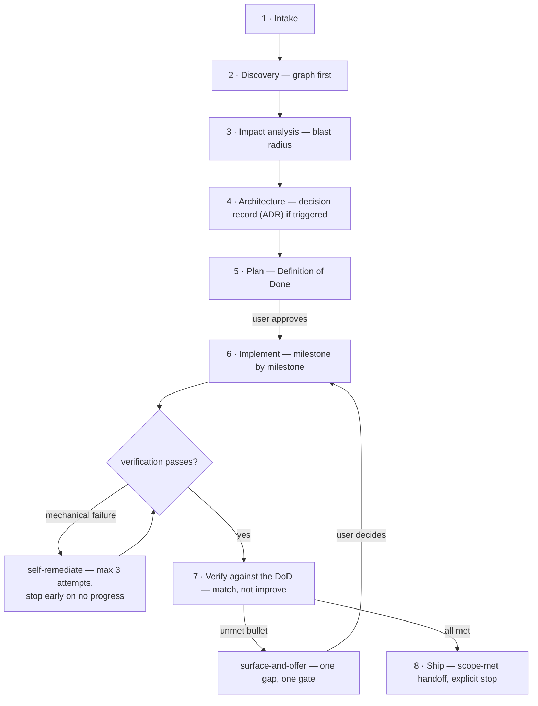
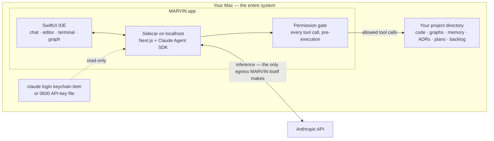
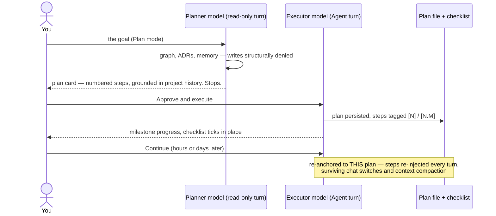
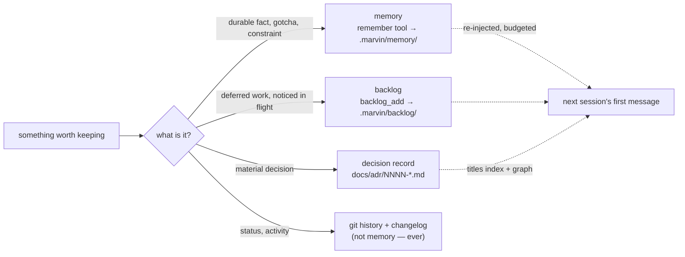
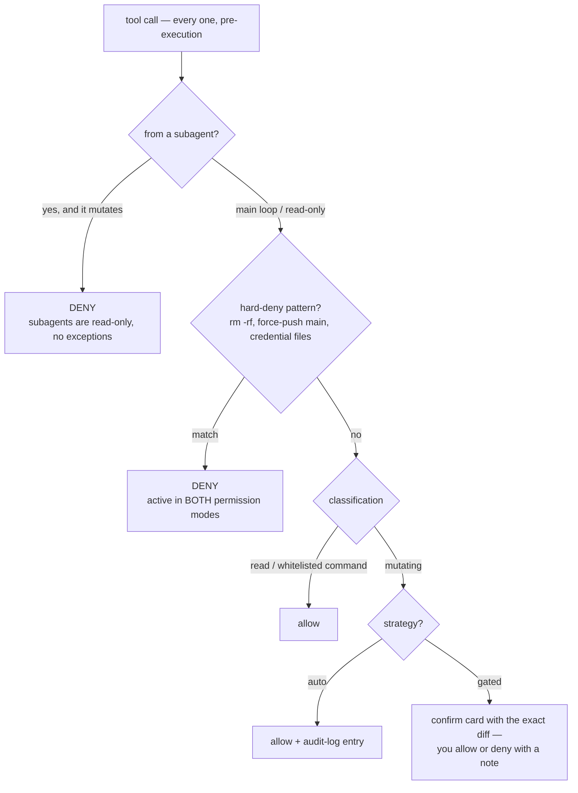

# M.A.R.V.I.N.

## One assistant, enforced discipline: a design for AI pair-programming that survives real projects

**Robert Ilisei** · August 2026 · v0.1.96 · [github.com/RobertIlisei/MARVIN](https://github.com/RobertIlisei/MARVIN)

*M.A.R.V.I.N. — Moderately Advanced Robotic Virtual Intelligence Network. A
pair-programming AI IDE for macOS.*

---

## Abstract

AI coding assistants perform impressively in demos and degrade steadily on
real projects. The causes are structural, not model-quality: context that
evaporates between sessions, agent architectures that amplify errors instead
of containing them, and guardrails written as prompt suggestions the model is
free to skim past. MARVIN is a working counter-proposal, built and used
daily by its author on real production projects. It makes four bets that run
against the current grain: **one** assistant moving through enforced phases
instead of a team of agents; a **knowledge graph** consulted before any file
is read; behavioral rules hardened into **enumerated contracts** — the most
load-bearing of them enforced at the tool gate, below the prompt; and a
strictly **local-first** architecture with no backend, no telemetry by
default, and credentials stored nowhere but your own machine. This paper
describes the design, the reasoning, the enforcement mechanisms, and the
results — each labeled measured, estimated, or design property — including
first-message context cut from ~566K tokens (an amount that no longer fit
the model's window) to ~13.4K on the same mature project, and multi-day
plans that survive session boundaries. MARVIN is open source and installs
via Homebrew.

---

## 1. The problem: AI assistance decays with project age

Every developer who has used an AI assistant on a project past week two
recognizes the pattern. The tool that wrote the first scaffolding flawlessly
begins to contradict decisions it made a month ago. It re-explores the
codebase from scratch each session, burning tokens on rediscovery. Feature
ten quietly breaks an assumption feature three was built on — and neither
the human nor the AI can hold the whole project in their head to notice.

Three structural failures drive the decay:

**Context does not persist.** A session's understanding — the architecture
choices, the gotchas, the "we tried that and it broke" — dies with the
session. The next conversation starts from zero, so long-lived projects pay
a rediscovery tax that grows with the codebase, while the *reasons* behind
decisions are lost entirely.

**More agents amplify errors instead of catching them.** The 2026
multi-agent evaluation literature reports what production users had already
noticed: on sequential coding work, multi-agent pipelines degrade output
quality by up to 70%, and flat "bag of agents" topologies amplify a single
agent's error up to 17× as peers build on each other's mistakes.¹ Handoffs
lose context; parallel writers race; a review agent rubber-stamps what a
planner agent hallucinated. The industry's answer to "one AI makes
mistakes" has been "add more AIs," and the evidence says that answer is
wrong for code.

**Guardrails are advisory.** Most tools express safety and process rules in
the system prompt: *please ask before deleting, please check the docs
first.* Long prompts thin a model's attention; a rule stated on page three
of a system prompt fires unreliably, and "use your judgement" degrades to
"do whatever the sampling temperature suggests." When MARVIN's own
development audited its prompt-only rules, a test-driven-development
directive had fired **approximately zero times across thousands of
qualifying turns**.² A rule that cannot be enforced is a hope, not a rule.

There is also a quieter fourth problem: **trust**. An agent with shell
access on a developer's machine, talking to a cloud service, is a serious
security surface. Developers are right to ask what it can touch, what it
phones home, and where their credentials go.

---

## 2. Design position: four bets

MARVIN is a macOS IDE — file tree, editor, terminal, chat — wrapped around
the Claude Agent SDK. Its interest to an engineer evaluating the field is
not the pane layout; it is four architectural bets, each a deliberate
rejection of a current default.

### Bet 1 — One assistant with phases, not an agent team

MARVIN is a single Claude session in a continuous user↔assistant loop. The
roles other tools distribute across agent teams — product owner, tech lead,
implementer, QA — exist in MARVIN as **phases one assistant moves
through**, in one conversation, with the user as continuous overwatch:
intake → discovery → impact analysis → architecture → plan → implement →
verify → ship. No handoffs between peers means no context loss at the
seams and no 17× error amplification.³



*Figure 1 — one assistant through eight phases. The only loops are
bounded: mechanical failures self-remediate at most three times (with an
early stop when consecutive attempts produce identical errors), and
scope-level gaps route through the user — never around them.*

The exceptions are narrow, and read-only. Exactly three kinds of subagent
are sanctioned — an **advisor** (a second opinion that stress-tests plans
and architecture decision records), a **scout** (breadth-first read-only
research), and read-only **audit fan-outs** — and all three are **unable to
write**: the file-editing tools are denied to them at the SDK level, and
the permission gate hard-denies any mutating tool call carrying a subagent
ID — including shell commands its classifier judges mutating.⁴ Parallel
*reading* scales fine. Parallel *implementation* is the failure mode the
literature documents, and MARVIN forbids it at the gate, not in prose.

### Bet 2 — The knowledge graph comes before the file read

For any structural question — *how does X work, who calls Y, what breaks
if I change Z* — MARVIN queries a per-project knowledge graph **before**
reading source files. Two graphs, actually: an AST-derived code graph
(functions, types, calls, imports) and a knowledge graph of the project's
documentation, architecture decisions, and memory. Both are rebuilt as you
work — per turn, debounced, while the project is open — at zero LLM cost.⁵

The economics are the point. A graph query answering "what depends on this
service" costs a fraction of the tokens of opening a dozen candidate files
— measured at 27.5× cheaper per structural question — and
catches couplings a keyword grep cannot see, because the graph encodes
*edges*, not text matches. The discipline is graph-to-locate, files-to-
verify: the graph points at two files out of hundreds; the assistant reads
exactly those and cites `file:line`. "Grep and pray" is the failure mode
this exists to eliminate.

### Bet 3 — Deterministic contracts, not "use judgement"

Everywhere MARVIN's behavior matters, a soft rule has been replaced with an
enumerated contract: a MUST-trigger list, a MUST-NOT list, and a narrow
judgement test only for cases the lists don't cover. When to consult the
graph. When a decision requires a written architecture record. When to
spawn the advisor. When a skill fires. What may be written to memory. Each
of these is a **firm surface** — auditable and testable.⁶

The novel step is pushing two of these contracts below the prompt entirely,
into the runtime: MARVIN's tool gate can **deny a blind source-file read**
when the graph should have been consulted first, and **deny an edit in
security-sensitive paths** until an advisor consult has happened. The
prompt asks; the gate *enforces*. This "design hooks" layer exists because
measurement showed prompt-only rules decay with prompt length — so the two
most load-bearing rules stopped being prompt rules.

Honesty about the ladder: most of the contract families are still
prompt-level. The enumerated MUST/MUST-NOT form measurably outperforms the
soft language it replaced — that is what the zero-fires audit forced — but
only gate-level rules are truly deterministic, which is why the direction
of travel is downward: when a prompt contract proves load-bearing, it earns
a runtime hook. The hooks themselves are configurable (enforce by default,
measure-only, off); the hard-deny floor and the subagent invariant are not
— no configuration weakens those two.⁷

The same philosophy governs scope. Before non-trivial work, MARVIN states a
falsifiable **Definition of Done** (3–5 bullets an observer could mark
yes/no) and verifies against exactly that — *match, not improve*.
Mechanical failures (typecheck, tests, build) self-remediate, capped at
three attempts with an early stop when consecutive attempts produce
identical errors. Scope-level gaps are surfaced with a proposed next step
and **gated on the user** — one gap, one gate. A fully autonomous
retry-until-done loop was considered and deliberately rejected: it
institutionalizes the "helpful spiral" of unrequested work that plagues
agentic tools.⁸

### Bet 4 — Local-first, or: there is no server

MARVIN has no backend. The app and its sidecar run on `localhost`;
inference goes directly from the user's machine to Anthropic via the Claude
Agent SDK. Precision matters here: inference necessarily carries prompt
context — including the code MARVIN reads — to Anthropic, and that is the
one network egress MARVIN *itself* makes. Tools acting on your behalf can
create others, each passing through the gate: a `git push` to your own
remotes, a shell command you allow, the opt-in browser. Credentials are
either the user's existing `claude login` (read from the OS keychain, never
copied) or an API key stored in a `0600` file on the user's own disk,
displayed only as its last four characters, and sent nowhere except
Anthropic.⁹ There is no telemetry by default; the
optional observability integration exports traces to the *user's own*
Honeycomb account, configured by the user. Release artifacts are signed
(minisign, with the public key pinned in three places across two
repositories), so the supply chain from GitHub Release to `brew install`
is verifiable.¹⁰

Project state follows the same principle: everything MARVIN learns about a
project — its graphs, memory, decision records, plans, backlog — lives in
*the project's own directory*, in plain text, in the user's repo. MARVIN
holds no cross-project state and starts every new project from zero, by
design. The user's data is the user's.



*Figure 2 — there is no server. The only egress MARVIN itself makes is the
inference call to Anthropic (which carries prompt context, including code
it reads); tool-driven egress — a `git push` to your remotes, an approved
shell command, the opt-in browser — happens on your behalf, through the
gate. Credentials are read in place, never copied or forwarded; all
project knowledge lives in the project's own repo.*

---

## 3. How it works: a session

The four bets compose into a working loop. What follows is the actual
shape of a session, not an idealization — the examples are drawn from real
production transcripts, anonymized.¹¹

**Modes set autonomy; the gate confirms edits.** Two orthogonal dials:
*mode* (what MARVIN may attempt — read-only **Ask**, autonomous **Agent**,
approval-gated **Plan**) and *permission strategy* (how each edit is
confirmed — **auto** or per-diff **gated**). The out-of-the-box defaults
are **Agent + auto** — near-full bypass, stated plainly because a
security-minded reader should know it — with the hard-deny floor
(destructive shell patterns, force-pushes to main, credential-file writes)
short-circuiting in both strategies and every mutating call classified and
written to an audit log regardless. Ask mode's read-only promise is
enforced at the gate, not requested: the file-editing tools are denied
outright, and shell commands pass the same mutating-or-not classifier that
polices everything else.

**Plan mode splits strategy from execution.** A Plan turn runs read-only on
the user's chosen *planner* model, presents a numbered plan grounded in the
project's own decision history, and stops. An explicit approval runs it as
a separate turn on the *executor* model. (Routing turns to different
models does not add agents: the conversation stays one thread with one
writer — "single assistant" is about loop topology, not model count.) The approved plan becomes a
durable spine: it persists to a file, ticks off step by step, survives chat
switches and app relaunches, and is re-injected into the model's context
every turn so context compaction cannot make the assistant forget what it
is executing. In a real multi-day session, a compliance-audit plan spanned
dozens of turns; each "Continue" re-anchored MARVIN to *that plan and only
that plan* — no re-auditing, no drift — while an advisor consult caught
five defects in a decision record before it was ratified.¹¹



*Figure 3 — planning and execution are different turns on different
models. Approval is an explicit act; a paused plan resumes itself instead
of ballooning into a re-audit.*

**Memory is curated, not logged.** Cross-session persistence is split by
content class, each with an enforced write path: durable *facts*
(invariants, gotchas, constraints) go to a memory index via a tool that
rejects status noise; deferred *work* goes to a backlog parking lot,
consent-gated, never auto-executed; *decisions* go to architecture decision
records; *status* goes to git. The design was forced by a real failure —
an activity-logged memory file that bloated to 419KB, ~99% redundant, and
overflowed the model's context window. The fix was not a bigger window; it
was content-class enforcement at the write boundary.¹²

Curation has a second half, though: a store that only ever grows stops
being read, and an unread backlog is indistinguishable from no backlog.
So the same store gained a **review** pass — it reports near-duplicates
that exact-title matching cannot see, auto-captures nobody triaged, items
referencing files that no longer exist. Every one of those is a heuristic,
which fixes the design: it *reports*, and the human decides. Nothing is
resolved, merged or re-prioritised on the strength of a guess, because
acting on a wrong heuristic deletes work nobody agreed to drop — the exact
loss the backlog exists to prevent. The instruction travels with the data
rather than only in the system prompt, so it survives being read out of
context.¹²

That principle — *surface, never mutate* — is the one to carry across.
Where an assistant's judgement is probabilistic, the safe boundary is
between analysis and application: let it be freely wrong in what it
notices, and structurally unable to act on being wrong.



*Figure 4 — persistence by content class, each with an enforced write
path. The write tools reject the wrong class, which is what keeps the
next session's context at ~13K tokens instead of 566K.*

**Work that outlives a turn is honest about it.** Background jobs fire a
real follow-up turn on process exit; scheduled wakeups re-invoke the
assistant at a chosen time; and the prompt contract flatly forbids
narrating a watcher that was never armed. Every real-work turn ends the
same way: the Definition of Done restated as past-tense facts, then an
explicit stop — *"Anything else, or should I stop?"*

---

## 4. What it delivers

Each result below is labeled for what it is — **measured** (a number with
a date and a method), **estimated** (engineering arithmetic, not a
benchmark), or a **design property** (verifiable in source, not in a
chart). All measurements are the author's own, on the author's projects;
n=1 developer is the honest sample size, and the reader's evaluation
should rest on the mechanisms, which are open source.

**Context that no longer overflows (measured — and honest about its
origin).** The baseline was MARVIN's own earlier design: it injected every
decision record plus an unbounded memory log, which on one mature
production project reached ~566K tokens (139 ADRs plus a 419KB memory
file) and simply failed to fit the model's window. The redesign — ADR
*index* instead of bodies, memory *tail* instead of log, knowledge graph
serving details on demand — brought the same project to **~13.4K
tokens**.¹³ Fixing a self-inflicted failure, yes; the claim is that the
*fix is architectural* — an index-plus-graph design whose context stays
budgeted as a project grows, instead of one that degrades back.

**Structural questions at graph prices (estimated).** The graph-first rule
replaces open-ended file exploration with one ranked query plus targeted
reads. This is now **measured, not estimated**: `graphify benchmark` on
MARVIN's own repository (2026-08-15) puts it at **27.5×** — 268,066 tokens
for a naive full-corpus read against ~9,763 per graph query.⁵ The earlier
~36× figure that appeared here was an engineering estimate that had never
been run against this repo, and is retired. The qualitative property holds
regardless of the multiplier: answers arrive with `file:line` citations
instead of synthesized guesses.

**Plans that survive days, not turns (design property, with transcripts).**
The durable-plan spine is the difference between "the assistant forgot the
plan after lunch" and a multi-day, dozens-of-turns execution that resumes
itself on every Continue. This is MARVIN's most visible end-result in
daily use, and the anonymized transcripts show it running on real work.¹¹

**Capabilities added since v0.1.55 (design properties).** Four are worth
naming because each extends a bet rather than decorating it.
*Provider independence* — an OpenRouter BYOK path with provider-aware model
resolution, so the assistant is not welded to one vendor's catalogue
([ADR-0096](../decisions/0096-provider-aware-model-resolution.md)).
*A real terminal* — a persistent login shell on a pty, in-process, so `cd`
persists, Ctrl-C interrupts, and a shell dies with the app rather than
orphaning ([ADR-0078](../decisions/0078-pty-terminal-in-process.md)).
*Parallel implementation without shared state* — the single amendment to
Bet 1: an implementer subagent bound to a git worktree MARVIN created may
mutate *that* checkout, because a worktree removes the sharing that makes
parallel agents dangerous
([ADR-0081](../decisions/0081-implementer-subagents-on-isolated-worktrees.md)).
*Blast radius before the edit* — directed call-graph queries answering "who
calls this, at which line" and "what does this branch touch outside itself",
which is Bet 2 applied to change rather than to search
([ADR-0084](../decisions/0084-blast-radius-and-pre-ship-impact-nudges.md),
[ADR-0085](../decisions/0085-graphify-beyond-search.md)).

**Guardrails that get measured, and corrected (worked example).** The
advisor originally persisted each caveat as its own backlog item. One
session produced **12 items in about a minute; 10 were dismissed at the
review and 2 kept** — the 10 were advice the executor had already acted on
in the same turn, arriving pre-satisfied. The cost was never the writes; it
was that two genuine blockers sat among ten dismissible ones. The design was
amended the same day to one durable record plus one review item, with
promotion deferred to the point where the user has the context to judge
([ADR-0095](../decisions/0095-advisor-verdict-is-read-and-caveats-persist.md)).
This is the intended failure mode of the whole approach: a deterministic
contract produces a number, the number contradicts the design, and the
design loses.

**Decisions that bind (design property).** Architecture decision records
written at decision time are re-read at the start of every future session
and cross-checked
during impact analysis. Month-eight work is confronted with month-two
constraints mechanically, not by luck. Ninety-seven ADRs govern MARVIN's own
development — the tool is built under its own discipline, and several of
its subsystems (the memory redesign, the context budget, the verify-then-
remediate contract) exist because that discipline surfaced a real failure
and forced a recorded fix.

**A safety floor (design property, with one documented gap).** The
subagent read-only invariant, the hard-deny floor, checkpoint-based change
review with revert, and the audit log together bound the blast radius of a
single bad model decision — and every tool-channel mutation is attributable
afterward. The gap is stated in §5: mutations made through shell commands
are not checkpoint-snapshotted.

---

## 5. The trust model, concretely

For an engineer deciding whether to run an agentic tool on their machine,
the security architecture is the evaluation. MARVIN's, in one place:

- **No backend.** All state local; inference direct to Anthropic; no
  MARVIN-operated service in the path. No telemetry by default.
- **Credentials.** Reuses `claude login` from the OS keychain (read-only,
  cached in-process, never persisted by MARVIN), or an API key in a
  `0600` file on the user's disk. Never logged, never displayed beyond a
  hint, never sent anywhere but Anthropic.⁹
- **A structural gate, not a confirmation dialog.** Every tool call passes
  a classifier *before* execution: auto-allow (reads, whitelisted
  commands), confirm (edits, writes, unlisted shell), hard-deny
  (destructive patterns) — with the deny floor active even in full-bypass
  mode, and an audit trail either way.
- **Subagents cannot write.** Any tool call from a spawned agent that
  would mutate the workspace is hard-denied at the gate. This is the
  invariant that makes read-only research fan-outs safe.⁴
- **Git is guarded at the argv level.** A single choke-point shells to
  git with `shell:false`, whitelists every ref and pathspec, rejects
  flag-injection vectors, and hard-denies force-pushes to main. Credential
  handling is inherited from the user's own helpers — MARVIN never
  prompts for, stores, or transforms git credentials.
- **Changes are reviewable and reversible — with one documented limit.**
  The gate snapshots each file's pre-image before the session first
  touches it; the review UI diffs against that snapshot, and reject
  reverse-applies — restoring the user's uncommitted state, which
  `git checkout` could not. The v1 limit, stated in the ADR and worth
  stating here: only tool-channel edits are pre-imaged. A mutation made
  *through a shell command* (`sed -i`, a codemod script) is not
  checkpoint-revertible — it is visible through git, but the snapshot
  mechanism does not cover it.
- **Signed releases.** Every release zip carries a minisign signature;
  the public key is pinned in the app repo, the tap repo, and the cask,
  so tampering with any one surface is visibly inconsistent with the
  other two.¹⁰



*Figure 5 — the decision ladder every tool call descends. The deny floor
and the subagent invariant sit above the auto/gated fork; no configuration
weakens those two. The Bet-3 design hooks (graph-first, advisor-on-trigger)
run inside the classification step and can turn an otherwise-allowed call
into a deny — they are the one layer with an off switch.*

None of this makes an LLM infallible. It makes the *consequences* of
fallibility bounded, visible, and — where the tool channel is used —
reversible, and it documents the places it falls short instead of
papering over them.

---

## 6. What MARVIN is not

Honest positioning, category by category:

- **Not an autocomplete tool.** MARVIN is a conversation-driven IDE, not
  an in-editor completion engine; it complements rather than replaces
  editor-native suggestion tools.
- **Not an agent swarm.** Tools built on parallel implementation agents
  promise throughput; the sequential-work evidence says they deliver
  error amplification. MARVIN's bet is the opposite: one accountable
  assistant, bounded read-only helpers, every write through one gate.
- **Not a cloud service.** There is no hosted MARVIN, no account, no
  server-side state, no usage dashboard watching the user. This costs
  MARVIN the features a backend enables (team sharing, cross-device sync)
  and buys the property that matters more to its audience: the code and
  the credentials stay home.
- **Not model-agnostic middleware.** MARVIN is built on the Claude Agent
  SDK and inherits its tool-use discipline; it routes different *roles*
  (planner vs. executor vs. advisor) to different Claude models, but it
  is not a thin wrapper over arbitrary LLM APIs.
- **Not free.** The discipline costs tokens: planning turns, advisor
  consults, and an 8-phase loop spend more per task than a bare CLI
  one-shot. The graph economics and the budgeted context are what claw
  the spend back; whether the trade nets out for you depends on how long
  your projects live. Short-lived scripts don't need MARVIN.
- **Not finished.** MARVIN is a young, opinionated, actively developed
  project (v0.1.x line, macOS/Apple Silicon only, releases weekly). The
  97 ADRs are public; so are the audits that found real flaws — including
  the ones MARVIN's own tooling caught in its own repository.

The through-line: where the field bets on *more autonomy*, MARVIN bets on
*more discipline* — encoded, wherever it has proven load-bearing, in
mechanisms that don't depend on the model having a good day, and honestly
labeled prompt-level where it hasn't yet.

---

## 7. Getting MARVIN

macOS (Apple Silicon), two commands, no toolchain:

```bash
brew tap RobertIlisei/marvin
brew install --cask marvin-ai
```

First launch requires macOS's one-time "Open Anyway" step (the app is
ad-hoc signed — no paid developer program — and installs to
`~/Applications`). MARVIN then needs Claude credentials: an existing
`claude login`, or an API key pasted in Settings.

- **Source & docs:** [github.com/RobertIlisei/MARVIN](https://github.com/RobertIlisei/MARVIN)
- **Worked examples of the modes and workflow:** [`docs/guides/workflows.md`](../guides/workflows.md)
- **Every functionality in depth:** the companion [Technical Reference](./TECHNICAL-REFERENCE.md)
- **Contributing:** the repo's ADRs (`docs/decisions/`) are the map of
  why things are the way they are; the roadmap (`docs/roadmap.md`) is the
  map of what's next. Both are the recommended first read.

---

## Notes

1. The ≈70% / ≈17× figures come from a 2026 research pass across published
   multi-agent coding evaluations (work from Google, UIUC, Microsoft, and
   Anthropic Research), recorded in
   [ADR-0001](../decisions/0001-single-assistant.md) as the project's
   founding design input — together with a failed multi-agent prototype of
   MARVIN itself. This paper reproduces them as the numbers the design bet
   on, not as results it independently verifies; the primary evidence
   offered here is the design and its source, not these figures.
2. Internal transcript audit, 2026-05-22: MARVIN session transcripts were
   scanned for turns matching each behavioral skill's own trigger
   conditions; five of six skills with "soft-nudge" prompt language had
   fired approximately zero times across thousands of qualifying turns.
   The finding drove the deterministic-trigger redesign.
3. The 8-phase workflow: [`docs/concepts/eight-phase-workflow.md`](../concepts/eight-phase-workflow.md).
4. Subagent read-only invariant:
   [ADR-0030](../decisions/0030-dynamic-workflows-read-only-fan-out.md);
   advisor and scout: ADR-0007, ADR-0014.
5. Graph architecture and lifecycle:
   [ADR-0028](../decisions/0028-multi-graph-architecture.md),
   [ADR-0041](../decisions/0041-project-graph-lifecycle-and-context-budget.md).
   The 27.5× figure is `graphify benchmark` run on this repository
   (2026-08-15), replacing an earlier ~36× estimate that was never measured
   here. It is one repo's number,
   graph query vs. multi-file reading; treat it as an engineering
   heuristic, not a benchmark.
6. The firm-surfaces catalogue: `CLAUDE.md` ("The firm surfaces") and
   `sidecar/packages/runtime/src/personality.ts` in the repo.
7. Runtime design hooks: `sidecar/packages/runtime/src/design-hooks.ts`
   (`enforce` / `measure` / `off`).
8. Verify-then-remediate contract: v0.1.55 (2026-07-02), documented in
   the changelog and roadmap.
9. Auth resolution: `sidecar/packages/runtime/src/auth.ts`,
   `auth-config.ts`; keychain read:
   [ADR-0029](../decisions/0029-keychain-token-read-for-model-discovery.md).
10. Release signing:
    [ADR-0026](../decisions/0026-release-artefact-signing-minisign.md).
11. Both examples — the multi-day compliance plan and the graph-first
    root-cause — appear with full anonymized transcripts in
    [`docs/guides/workflows.md`](../guides/workflows.md).
12. Memory as durable facts:
    [ADR-0042](../decisions/0042-memory-as-durable-facts.md); backlog:
    [ADR-0044](../decisions/0044-project-backlog.md); backlog review, and
    why it reports rather than reconciles:
    [ADR-0063](../decisions/0063-backlog-groomer-review-not-execute.md);
    classification (`kind`, and `blocked` as its own axis):
    [ADR-0064](../decisions/0064-backlog-kind-and-blocked.md).
13. Context budget measurement:
    [ADR-0041](../decisions/0041-project-graph-lifecycle-and-context-budget.md).
    Measured 2026-06-14 on one mature production project — not MARVIN's own
    repo — whose context comprised 139 ADRs plus a 419KB memory log
    (~566K tokens before the redesign; ~13.4K after). n=1; the mechanism,
    not the multiplier, is the claim.

---

*© 2026 Robert Ilisei. MARVIN is open source (MIT). This paper describes
v0.1.96; the repository is the authoritative, current reference.*
